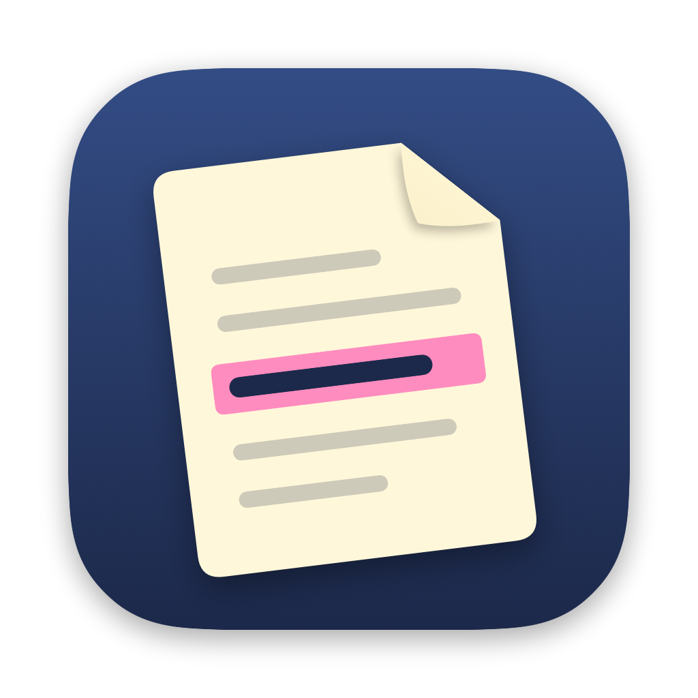

<p align="center">
  
</p>

<h1 align="center">Earmark</h1>

<p align="center">Live, private captions for phone interpreters on the Mac.</p>

---

Remote interpreters spend all day holding on to details they have to say back: phone numbers,
addresses, dates of birth, member IDs. Earmark listens through a small microphone clipped to the
headset, captions the call in large text, tells the speakers apart, and keeps every number and
address in a list you can copy from with one click.

**Everything runs on your Mac.** Speech recognition, speaker separation and voice detection are
on-device models running on the Apple Neural Engine. No audio or text ever leaves the machine, and
nothing is saved when you close the app.

## Features

- **Live captions** in large, adjustable text, with the current sentence updating as it's spoken.
- **Kept details**: phone numbers, addresses, dates, amounts and IDs are highlighted and collected
  in a side list. Click any of them to copy. Press <kbd>K</kbd> to keep the last line.
- **Who's speaking**: each voice gets its own label and colour. Rename speakers ("Me",
  "English caller"…), dim or hide their lines, and **merge** two labels when the model splits one
  person in two.
- **Knows your voice**: record a 15-second sample once and your own lines are labelled "Me" and
  dimmed, so the callers stand out. The sample is stored only on your Mac.
- **Wireless mic friendly**: picks a wireless lav (e.g. BOYA) automatically, warns when the
  transmitter goes silent (off, unpaired, or mid battery swap), and recovers when the receiver is
  unplugged and plugged back in.
- **Guided setup** on first launch: microphone, one-time model download, voice sample, tips.

## Install

Download the latest `Earmark-x.y.z.dmg` from [Releases](https://github.com/Eimen2018/earmark/releases),
open it and drag Earmark to Applications. The app is signed with a Developer ID and notarized by Apple.

Requires a Mac with **Apple Silicon** and **macOS 15** or later. On first launch Earmark downloads
its speech models (about 600 MB) from Hugging Face; after that it works offline.

## How it works

```
mic ─▶ AVCaptureSession (16 kHz mono)
          ├─▶ Silero VAD ──▶ utterances ──▶ Parakeet TDT v2 (English) ──▶ captions
          └─▶ Sortformer streaming diarization ──▶ who spoke each utterance
captions ─▶ NSDataDetector + patterns ──▶ highlighted details ──▶ Kept list
```

- [FluidAudio](https://github.com/FluidInference/FluidAudio) runs all three models with Core ML.
- **Parakeet TDT 0.6B v2** (NVIDIA) transcribes each utterance; the live line is re-transcribed
  every second while someone is still talking.
- **Sortformer** (NVIDIA) gives per-frame probabilities for up to four speakers; each caption line
  takes the speaker with the most probability over its span, and is re-checked two seconds later
  once the diarizer has more context.
- Your voice sample is fed to Sortformer at the start of each call so your slot is named "Me".

## Limitations

- English captions only. Speech in other languages is transcribed as English-looking text; give
  that speaker a name and set them to *Hide* if it gets in the way.
- Speaker labels start fresh with every **New call**.
- Audio picked up from a headset earpiece is quieter and narrower than a room mic, so expect the
  occasional wrong word or split speaker. Always confirm numbers with the caller.
- Check your agency's policy on transcription tools, even fully local ones.

## Build from source

```bash
brew install xcodegen
xcodegen generate
open Earmark.xcodeproj
```

Signing is set to a Developer ID team in `project.yml`; change `DEVELOPMENT_TEAM` (or set
`CODE_SIGN_IDENTITY` to `-` to sign locally).

To produce a notarized DMG (needs `create-dmg` and a notarytool keychain profile):

```bash
NOTARY_PROFILE=my-profile Scripts/release.sh
```

The app icon is drawn in code: `swift Scripts/render-icon.swift Resources/AppIcon-1024.png`.

## Credits

- [FluidAudio](https://github.com/FluidInference/FluidAudio) (Apache 2.0)
- NVIDIA [Parakeet TDT 0.6B v2](https://huggingface.co/nvidia/parakeet-tdt-0.6b-v2) (CC-BY-4.0)
  and [Sortformer](https://huggingface.co/nvidia/diar_streaming_sortformer_4spk-v2) (NVIDIA Open Model License)
- [Silero VAD](https://github.com/snakers4/silero-vad) (MIT)

## License

MIT © Aymen Nurhussen
